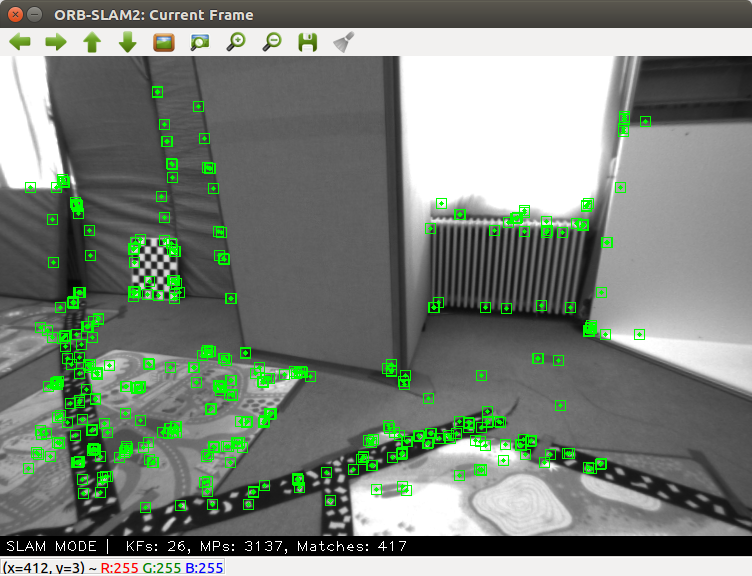
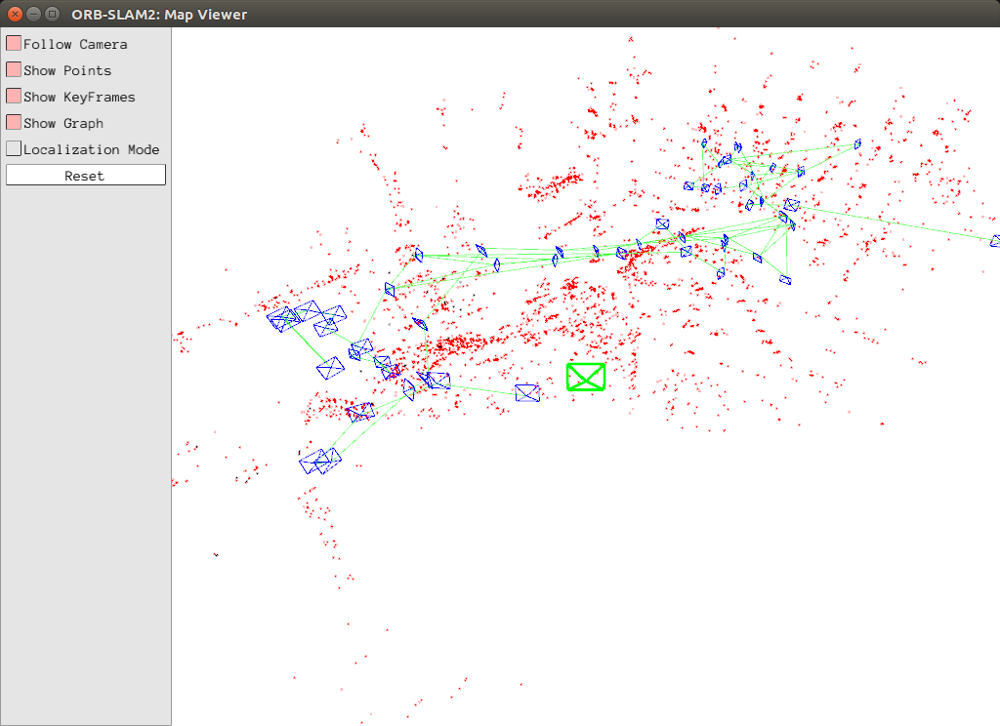
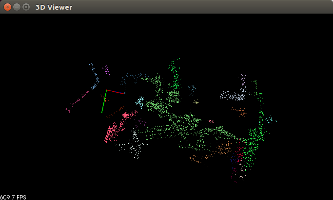
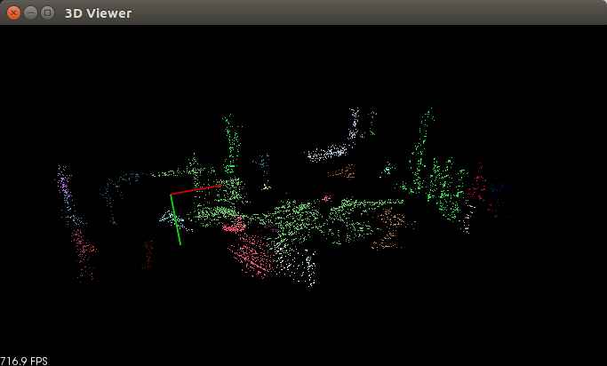
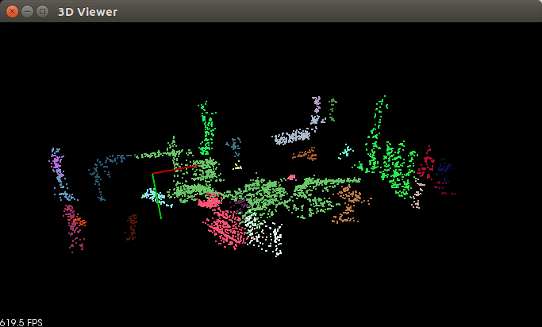

# homework3

University of Verona - IT department - Computer Science

## Description
This homework provide a modified version of ORBSLAM2(a real-time SLAM library for Monocular, Stereo and RGB-D cameras that computes the camera trajectory and a sparse 3D reconstruction) to create a point cloud(pcd file) from a rosbag and a clustering algorithm.

## Realization

The original version of ORBSLAM2 can only display the information of a rosbag. We have added a function that allows you to save the corresponding point cloud to the reconstruction of the 3D points generated by SLAM algorithm. This function save the information in a txt file. To convert into a .pcd file we developed "txt_to_pcd.cpp" file. With "clustering.cpp" file you can cluster the point cloud based on the Euclidean distance. We set the Cluster tollerance to 0.15 and the minimum cluster size to 30, but these set is linked to our pointcloud . If you use a different point cloud you have probably change these information.

## How to compile:

Move into "homework3" directory and use this comand:

* mkdir build 
* cd build
* cmake ..
* make

You will find the executables in bin directory

## Link to ORBSLAM

Use this comand to obtain ORBSLAM2:

git clone https://github.com/davemol/ORB_SLAM2.git

NB:

Clone the package into ~/catkin_ws/src

## Image

These image is obtain with this rosbag:
http://robotics.ethz.ch/~asl-datasets/ijrr_euroc_mav_dataset/vicon_room1/V1_01_easy/V1_01_easy.bag

 ORBSLAM2 

 CLUSTERING 

## Author

Davide Molinari 
Marco Zenere 

## Disclaimer

homework3 is provided without any warranty about its usability. It is for educational purposes and should be regarded as such.

## Info

Please, report suggestions/comments/bugs to 
davide.molinari@studenti.univr.it 
marco.zenere@studenti.univr.it 

